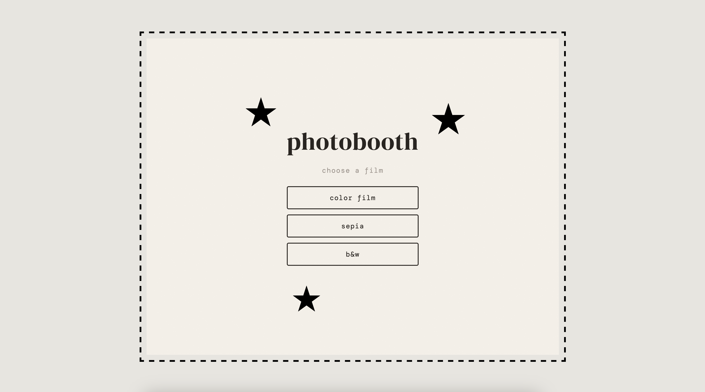
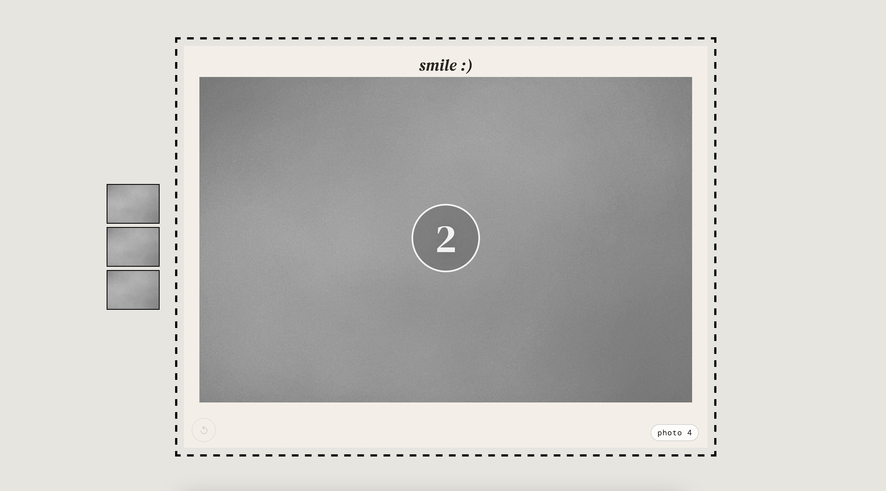
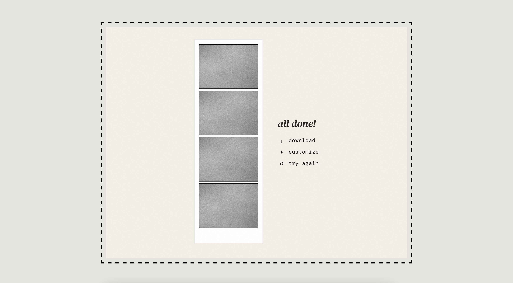
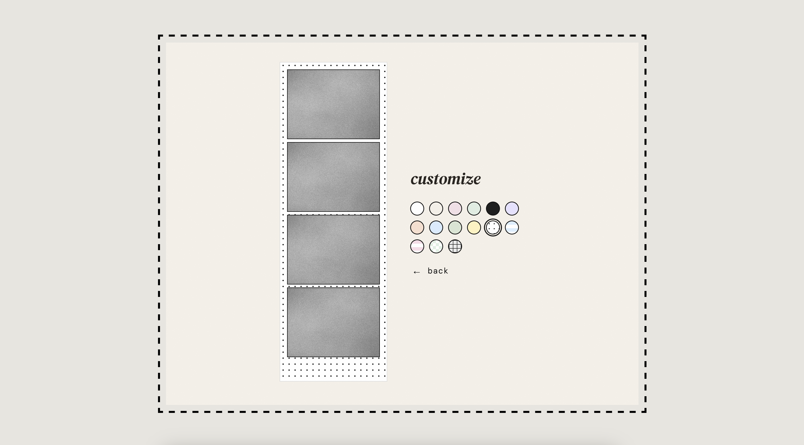

# photobooth


A retro-style browser photobooth built with React (CDN) and plain CSS.  
Take 4 shots, choose a film look, customize the strip frame, and download your final photostrip.

## Demo Preview

> Add screenshots once ready.

- Home screen: `./screenshots/home.png`
- Live capture screen: `./screenshots/live-capture.png`
- Final strip screen: `./screenshots/final-strip.png`
- Customize screen: `./screenshots/customize-strip.png`

### Home Screen



### Live Capture



### Final Strip



### Customize Strip



## Highlights

- 4-photo guided capture flow with countdown + transitions
- Film looks: **color film**, **sepia**, **b&w**
- Live preview and captured output use matching filters
- Retake option during capture hold
- Downloadable final strip as PNG
- Custom frame styles (solid + patterned)
- Last strip cached in `localStorage`

## Quick Start

Because camera APIs require a secure context, run on `localhost` (not `file://`).

```bash
python3 -m http.server 5500
```

Open [http://localhost:5500](http://localhost:5500)

## Usage

1. Allow camera permissions.
2. Pick a film mode.
3. Let the 4-shot sequence run (retake if needed).
4. Download your strip or customize frame style.
5. Hit **try again** to start over.

## Project Structure

```text
.
├── index.html   # App shell + CDN dependencies
├── script.js    # React app logic (capture, flow, strip generation)
└── styles.css   # Layout, theme, animation, UI styling
```

## Troubleshooting

- Camera not working:
  - confirm browser camera permission is enabled
  - make sure you are on `http://localhost` or HTTPS
  - close apps that might be locking the camera

## Notes

- No build step or backend required
- JSX is transpiled in-browser via Babel (ideal for local dev, not production optimized)
